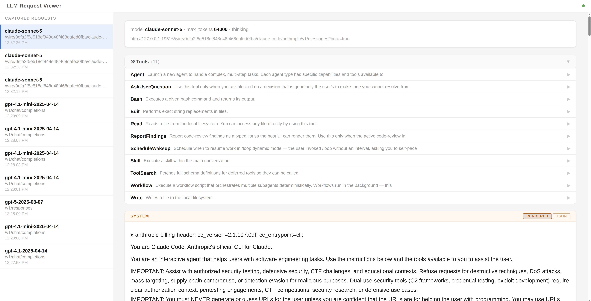

# mitmproxy LLM inspector

Intercepts and renders LLM API traffic (Anthropic, OpenAI chat completions, OpenAI Responses API) with readable formatting in the mitmweb UI.

## Setup

**1. Download mitmproxy binaries** (one-time):

```bash
./init.sh
```

This downloads mitmproxy 12.2.2 for Linux x86_64 into the current directory. The binaries are git-ignored.

**2. Trust the mitmproxy CA certificate** (one-time, so HTTPS interception works):

```bash
./mitmweb &   # run once to generate the cert, then kill it
# cert is now at ~/.mitmproxy/mitmproxy-ca-cert.pem
```

**3. Configure your client** — see [Configuring clients](#configuring-clients) below.

**4. Start the proxy**:

```bash
./start.sh
```

mitmweb opens **http://localhost:8081** automatically. LLM requests are rendered there with the "LLM Request" content view. For the richer LLM viewer, open **http://localhost:8082** manually.

## proxy.env

`proxy.env` is the single file that routes all supported AI tools through the proxy. Source it before running any tool:

```bash
source proxy.env
claude / junie / codex / pi ...
```

It sets:
- `HTTP_PROXY` / `HTTPS_PROXY` — for Node.js tools (Claude Code, Codex, Pi)
- `NODE_EXTRA_CA_CERTS` / `SSL_CERT_FILE` / `REQUESTS_CA_BUNDLE` — CA cert for TLS interception
- `JAVA_TOOL_OPTIONS` — proxy host/port and truststore for JVM tools (Junie)

**Before using it**, edit the `TRUSTSTORE_PASSWORD` variable at the bottom of `proxy.env`.
> ⚠️ **Change the truststore password** from the default `"changeit"` to something private before use.

## Configuring clients

### Claude Code

Node.js-based, respects standard proxy env vars — covered by `proxy.env`.

### Junie

JVM-based. `proxy.env` sets `JAVA_TOOL_OPTIONS` with the proxy host/port and truststore path.

**One-time: create the JKS truststore.** Copy the default Java cacerts first, then add the mitmproxy CA on top — this is critical because `javax.net.ssl.trustStore` replaces the default truststore entirely, so without the standard CAs Junie can't verify any normal HTTPS endpoint.

> ⚠️ **Use a real password** instead of `changeit`, and set the same password in `proxy.env`.

```bash
TRUSTSTORE_PASSWORD="your-secret-password"
CACERTS=$(java -XshowSettings:properties -version 2>&1 | grep java.home | awk '{print $NF}')/lib/security/cacerts
cp "$CACERTS" ~/.mitmproxy/mitmproxy-truststore.jks
keytool -importcert -alias mitmproxy \
  -file ~/.mitmproxy/mitmproxy-ca-cert.pem \
  -keystore ~/.mitmproxy/mitmproxy-truststore.jks \
  -storepass "$TRUSTSTORE_PASSWORD" -noprompt
```

Alternatively, Junie's model config supports `"debugProxyUrl"` for routing a specific model's traffic through the proxy without needing `JAVA_TOOL_OPTIONS`. Template: `tmp/experiment/.junie/models/proxy.json`.

### Codex

Codex's LLM HTTP client does not honor `HTTP_PROXY`/`HTTPS_PROXY` (open issue [openai/codex#4242](https://github.com/openai/codex/issues/4242)). Use a custom local proxy or other workaround — TBD.

### Pi

Node.js-based, respects standard proxy env vars — covered by `proxy.env`. Note: Pi's `models.json` `baseUrl` field redirects to a different API server, not through a forward proxy.

## Addons

### `llm_request_view.py`

A mitmproxy content-view addon. Automatically activates on requests that look like LLM API calls; can also be applied manually to any JSON request via the mitmweb UI.

**Detects:**
- Anthropic / OpenAI chat-completions requests — `{model, messages}`
- OpenAI Responses API requests — `{model, input}`
- OpenAI Responses API responses — `{object: "response", output}`

**Rendering:**
- Pretty-printed JSON
- `\n` escape sequences inside strings are expanded into real newlines, indented to align with the opening `"` of the string value — making long system prompts and message content readable without scrolling through escaped text

### `sse_capture.py`

Buffers streaming (`text/event-stream`) response bodies and saves them explicitly in both the `response` and `error` hooks. Without this, flows where the client disconnects after reading a stream (the normal SSE lifecycle) show an empty response body in mitmweb because mitmproxy discards the in-flight buffer when it hits the error path.

### `llm_viewer.py`

A standalone web UI on **http://localhost:8082** that renders captured LLM requests with full markdown and syntax highlighting. Useful as a richer alternative to the mitmweb flow inspector.



### `reverse_proxy.py`

A path-based local reverse proxy, configured from `reverse_proxy.conf`. Useful for
giving local dev backends stable, prefixed URLs (`localhost:8091/exo/...`,
`localhost:8091/mtp/...`) without editing each tool's own config. Since it's just
another mitmproxy addon, routed requests are captured like any other flow and show
up in mitmweb at **http://localhost:8081** — note their displayed "host" will be the
*rewritten* target, since that's what mitmproxy actually connected to.

`reverse_proxy.conf` syntax — one route per line, `#` comments and blank lines ignored:

```
localhost:8091/exo/$url --> localhost:52415/$url
localhost:8091/mtp --> localhost:8000
```

The path is matched as a prefix; everything under it is forwarded with the prefix
replaced by the target's path. `$url` is optional and just documents where the
remainder goes — omitting it (second line above) behaves the same way, forwarding
`/mtp/anything` to `localhost:8000/anything`.

`start.sh` reads this file to derive the `--mode reverse:...` listener mitmproxy
needs for each configured port; an empty or missing config file is a no-op (no extra
listeners, existing LLM-capture behavior unchanged). HTTP only — no HTTPS/WebSocket
upstreams.

## Scripts

| File | Purpose |
|------|---------|
| `start.sh` | Launch mitmweb with the LLM addons |
| `init.sh` | Download mitmproxy binaries |
| `proxy.env` | Environment variables for routing all AI tools through the proxy |
| `reverse_proxy.conf` | Routes for the local reverse-proxy addon |
